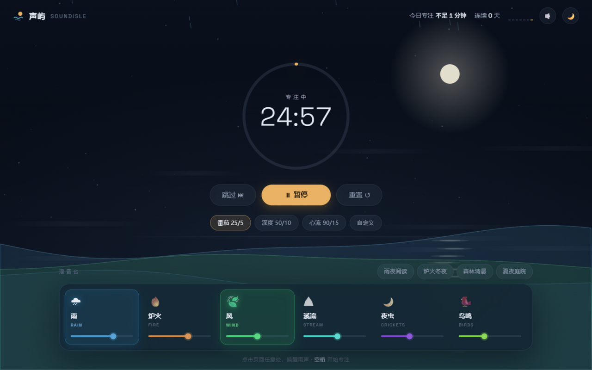
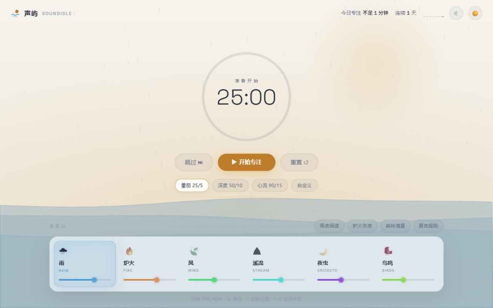

# 声屿 SoundIsle 🏝

**一个专注声境工作台**：六个环境音通道全部由 Web Audio 实时程序化合成——没有任何音频素材文件，打开即用，离线可用。





## 功能

- **夜海场景**：整个页面是一片随混音变化的夜海——星空、月与月径、三层海浪随启用通道的色相与实时能量起伏，雨丝、余烬、流萤、薄雾、水光、掠影各随其声；静音时海面黯淡
- **六通道混音台**：雨（含随机远雷）、炉火、风、溪流、夜虫、鸟鸣。点击开关（0.8s 淡入淡出），拖杆调音量，每个通道有专属色相，点亮即所见
- **专注计时器**：番茄 25/5 · 深度 50/10 · 心流 90/15 · 自定义分钟数；圆环进度、呼吸光晕、阶段自动切换与搏动提示、合成风铃、标签页标题倒计时
- **声景预设**：雨夜阅读 / 炉火冬夜 / 森林清晨 / 夏夜庭院，一键编排多通道
- **专注统计**：今日专注时长、连续天数、最近 7 天迷你柱状图，全部本地存储
- **明暗双主题**（夜海 / 晨光纸）、键盘快捷键、响应式（桌面单屏无滚动）、`prefers-reduced-motion` 降级为静帧海面

## 快捷键

| 键 | 作用 |
|----|------|
| `空格` | 开始 / 暂停计时 |
| `1-6` | 开关对应声音通道 |
| `M` | 静音 / 取消静音 |
| `T` | 切换明暗主题 |

## 运行

```bash
npm install
npm run dev        # 开发：http://localhost:5173
npm run test       # Vitest 单元测试（32 个）
npm run build      # 类型检查 + 产物构建（dist/）
npm run preview    # 预览生产构建：http://localhost:4173
```

要求现代浏览器（Chrome / Edge / Firefox / Safari）。声音需要一次用户交互后启动（浏览器自动播放策略）。

## 技术要点

- **近零运行时依赖**：Vite + TypeScript + Space Grotesk 字体，原生 Web Audio / Canvas / localStorage
- **音频引擎**（`src/audio/`）：白/粉/棕噪声缓冲工厂（去直流 + 环绕交叉淡化消除循环接缝）+ 双层滤波器组（持续层）+ 随机事件调度器（雨滴、爆裂、雷、鸟叫、气泡、虫鸣串）+ 每通道增益与频谱分析抽头
- **夜海场景**（`src/ui/scene.ts`）：单画布、DPR ≤1.75、粒子数随通道音量伸缩，频谱能量来自每通道分析器抽头
- **对自动播放策略的防御**：AudioContext 挂起时增益走直接赋值而非时间自动化，避免时钟冻结导致的淡入淡出失效与恢复跳变
- **动画保险丝**：入场动画 2.5s 后强制落位，环境节流（后台标签页加载）不再可能把 UI 冻在半透明中间态
- **可测性**：计时器状态机与统计为纯逻辑，时钟与调度器均可注入；存储层可换内存后端；引擎暴露输出抽头供波形测量

## 结构

```
src/
├── audio/            # 引擎、噪声工厂、调度器、六通道合成、风铃
│   └── channels/
├── timer/            # 状态机与计时模式
├── state/            # store、持久化、统计
├── ui/               # 夜海场景、组件、预设
├── styles/           # 设计令牌（明暗）、基础、组件、响应式
└── main.ts           # 装配入口
tests/                # 单元测试（timer / stats / storage / presets）
```

## 设计迭代

五轮「实现 → 测试 → 批评 → 修改」的完整记录见 [docs/iterations.md](docs/iterations.md)。

## 许可

[MIT](LICENSE) © 2026 HrrY1n
